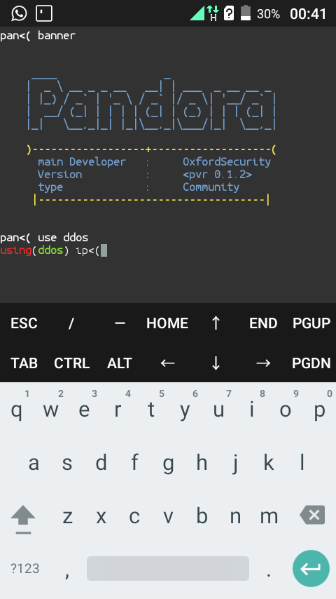

# The Pandora-Framework

This is a framework which consist of various tools needed in **Penetrating Testing**.This tool is simple to use and user friendly which means *it gives specific instructions on what to do when prompted* ,it does not require users to type a longer command to achieve a target.It based on the concept of exploitation, digital forensics,and research.
# Screenshot
 
 _The world simplest yet powerful tool_

## Goal
Pandora developers seek to make this tool a very powerful tool for penetrating testing.

## Message to contributors
Contributors are welcome whether you code in python or not,if you dont code in python you can always share ideas or suggestion.
 And all contributors must join the whatsapp group chat to discuss the project.[whatsapp chat](https://chat.whatsapp.com/HseBYZRyFKR4or9cAg2zC8)

## Suggestions
Add suggestions or ideas here to improve *Pandora*


- hash  cracker would be cool    -    mohammed

# Installation

clone the repository from github:

```
git clone https://github.com/OxfordSecurity/Pandora-Framework.git
```

After that **Follow the following commands one by one**
```
cd Pandora-Framework

chmod +x *

#no need to execute requirements.txt
#they will be installed in the installation process

./install.py

ls
```
You will will see two executive files **_Pandogen_** and **_Pandora_**.Run the program by typing:
```
./Pandora

```
Congratulation you are using pandora.

type `help` to check commands
